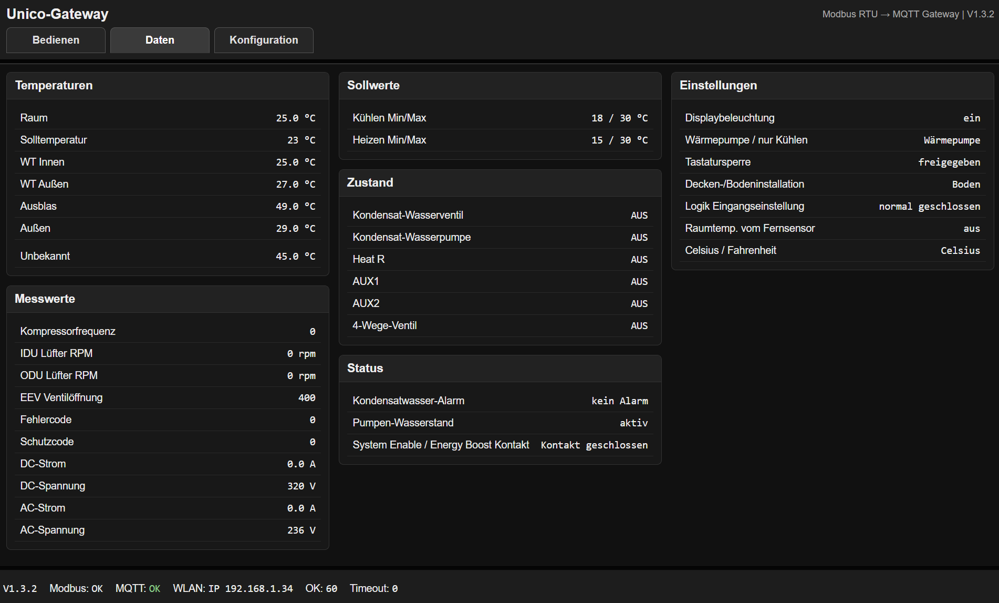

# Unico Modbus MQTT Gateway

This software was written entirely with the help of AI. It has not been professionally audited, certified, or validated for safety-critical use.

Use this project at your own risk. The author assumes no responsibility for damage, malfunction, data loss, incorrect control of connected devices, or any other consequences resulting from the use of this software.

For safety and security reasons, this device should preferably be used only in a trusted local network. It is strongly recommended not to expose the gateway to the internet and not to allow direct internet access to the device.

This ReadMe was alo generated by AI

---

## Overview

**Unico Modbus MQTT Gateway** is an ESP32-based gateway for an Olimpia Splendid / UNICO air conditioner with RS485 Modbus support.

The gateway polls selected Modbus registers from the air conditioner, displays the values in a local web interface, and publishes them via MQTT for systems such as openHAB, InfluxDB, Grafana or other home automation tools.

The web interface is designed as a user-friendly gateway interface, not as a raw Modbus diagnostic tool. Normal pages do not show raw Modbus telegrams, register addresses, or CRC details.



---

## Main Features

- ESP32-based RS485 Modbus gateway
- Local web interface
- MQTT publishing for openHAB and InfluxDB
- English MQTT topic structure
- German web interface
- Configurable WiFi, Access Point, MQTT and Modbus settings
- Optional password protection for configuration
- Optional password protection for climate control commands
- MQTT command support can be enabled or disabled
- Settings stored in ESP32 Preferences / NVS
- Default values provided through `UGW_secrets.h`
- WLAN reconnect
- Local fallback Access Point
- NTP synchronization
- Designed for local network use

---

## Hardware

Tested target hardware:

- ESP32
- RS485 transceiver board
- Olimpia Splendid / UNICO air conditioner with Modbus / RS485 interface

Default ESP32 pin assignment:

| Function | ESP32 Pin |
|---|---:|
| RS485 RX | GPIO16 |
| RS485 TX | GPIO17 |
| RS485 DE / RE direction control | GPIO18 |

Typical wiring:

| ESP32 / RS485 Board | Function |
|---|---|
| GPIO16 | RS485 RO |
| GPIO17 | RS485 DI |
| GPIO18 | RS485 DE + /RE |
| GND | Common ground if required |
| A / B | RS485 bus to air conditioner |

---

## Arduino Project Structure

The Arduino sketch folder should look like this:

```text
Unico-MQTT-Gateway/
  Unico-MQTT.Gatewayino
  UGW_secrets.h
